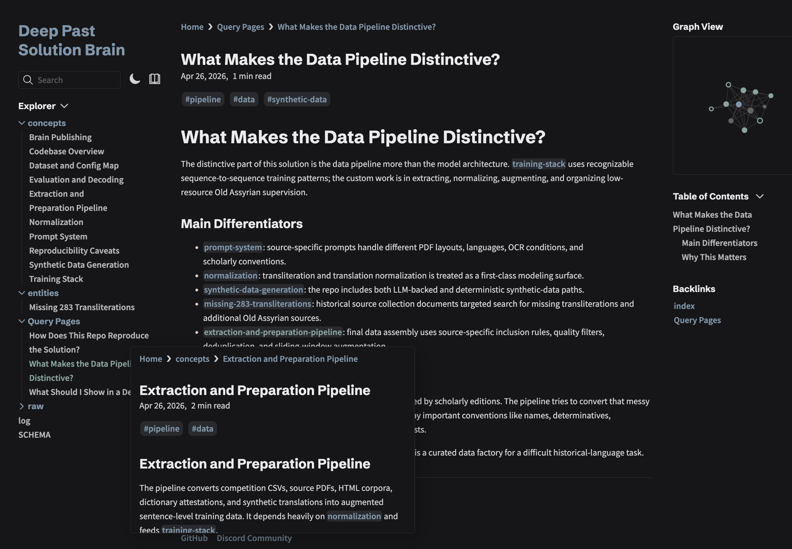

title: I got it wrong: the agent needs a brain
link: i-got-it-wrong-the-agent-needs-a-brain
published_date:
------------------

About a month ago I wrote about [stopping coding](https://darragh.bearblog.dev/i-stopped-coding-for-11-weeks-and-still-placed-3rd-on-kaggle/). The short version: I used Claude Code as my only development tool, wrote no code by hand, and spent most of my time specifying workflows, checking outputs, and deciding what to try next.

Since then I started working on [ARC-AGI-2](https://www.kaggle.com/competitions/arc-prize-2026-arc-agi-2), and the agent got a brain. Thanks to Alessio and Raja for nudging me in that direction.

Between the brain and stronger Codex models, I can give the agent much more autonomy because memory no longer has to live in the startup file. Less for me to do, which is the point.

## From One Big File to a Brain

Back then, my `CLAUDE.md` grew into a large operating manual.

But it also mixed two different things:

- instructions for how the agent should behave;
- documentation of what the project currently knew.

Those are not the same thing. Instructions should be stable. Documentation changes constantly.

The [Claude Code docs](https://code.claude.com/docs/en/memory#write-effective-instructions) are explicit about this: "target under 200 lines per CLAUDE.md file. Longer files consume more context and reduce adherence." Once I started packing in both rules and project history, the file became diluted. The agent could still read it, but the signal was mixed.

In ARC, I started using an `llm-wiki` style project brain much more seriously.

This came from [Andrej Karpathy's LLM Wiki idea](https://gist.github.com/karpathy/442a6bf555914893e9891c11519de94f): instead of rebuilding context from raw documents every time, have the agent compile raw material into a persistent Markdown wiki.

It is just markdown files in `brain/`: a schema, index, log, concept pages, entity pages, comparisons, proposals, and filed query answers.

The important part is the separation:

| Layer | Job |
|---|---|
| `AGENTS.md` | Stable operating rules |
| Skills | Repeatable procedures |
| `brain/` | Project memory and synthesis |
| Scripts/configs | Executable truth |

`AGENTS.md` became the constitution. The brain became the library.

My actual prompt became much simpler:

> "Look up the brain and tell me which params I trained this experiment with."

The current [`AGENTS.md`](https://github.com/darraghdog/deep_past_challenge_3rd_place/blob/main/AGENTS.md) is short and practical: secrets, data safety, common commands, normalization rules, and publishing hygiene. The detailed explanation lives in the [brain](https://darraghdog.github.io/deep_past_challenge_3rd_place/): extraction pipeline, prompt system, synthetic data, and query pages like "what makes this data pipeline distinctive?"

## Skills Run the Workflow. The Brain Keeps the Thread.

A skill answers: "How do I run this workflow?"

The brain answers: "Why are we running it, what happened last time, and what did we decide?"

The distinction matters. A skill tells the agent how to run a training smoke test; the brain can look up the previous tests from two weeks ago.
